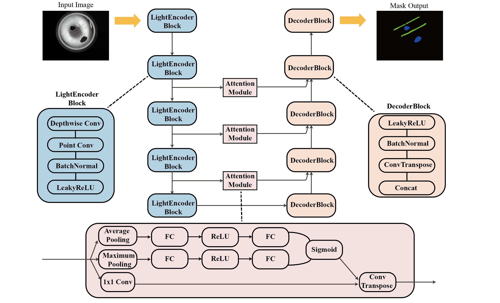
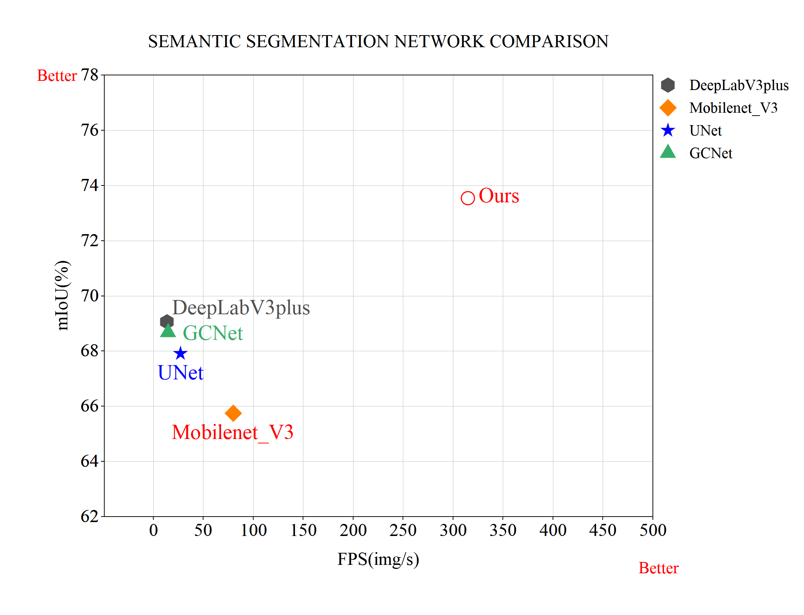

# Aluminum-defect
A Lightweight Convolutional Network for Few-Shot and Multi-Class Detection of Tiny Aluminum Defects

The original paper can be found [here](https://github.com/NETgonight/Aluminum-defect/tree/main/paper).

##  Challenges

This project addresses two key challenges in the field of industrial aluminum sheet surface defect detection:

- **Limited Training Data**: The difficulty in capturing small defect features with limited training data.
- **Industrial Deployment Needs**: The demand for high efficiency and lightweight structures in industrial applications.

## Solution Overview

To tackle the above challenges, we propose a **solution based on attention mechanisms and lightweight architecture**\. Our approach involves designing an efficient encoder-decoder network that utilizes:



- Channel-wise convolutions and point convolutions to **reduce computational costs**.
- Spatial and channel attention modules embedded in skip connections between encoder and decoder modules to **enhance the recognition of subtle defects**.

## Experimental Results

We compared our model with traditional segmentation models, and the results are showcased below:



The experimental results indicate that our method achieves **high precision (73.54% mIoU)** on a small sample aluminum sheet defect dataset. It also demonstrates **extremely fast inference speed (314.55 FPS)** on a single V100 GPU, along with a **small model size (0.114M parameters)**.

## Getting Started

### Requiremenets

| Package     | Version      |
| ----------- | ------------ |
| torch       | 2.0.1+cu118  |
| torchvision | 0.15.2+cu118 |

### Train in Command Line

First, use the tools in the dataset_toolbox folder to prepare the dataset. Then run 'python train.py' to start training.

```
python train.py
```

